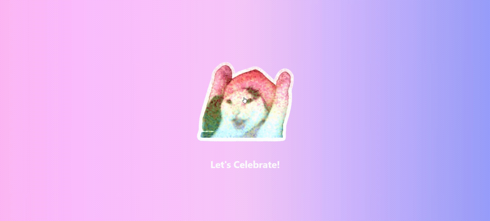

# Confetti
- cdn ตัว Confetti มาใช้
- มีการใส่เสียง Effect
    - [link to effect sound](https://www.myinstants.com/en/index/th/)



**หมายเหตุ**
- ในคลิปตัวอย่างนี้คือ gif จึงไม่ได้ยินเสียง

## code
```html
<!DOCTYPE html>
<html lang="en">
<head>
    <meta charset="UTF-8">
    <meta name="viewport" content="width=device-width, initial-scale=1.0">

    <!-- Tailwind CSS -->
    <script src="https://cdn.tailwindcss.com"></script>

    <!-- daisyUI -->
    <link href="https://cdn.jsdelivr.net/npm/daisyui@latest/dist/full.css" rel="stylesheet" />

    <!-- Confetti -->
    <script src="https://cdn.jsdelivr.net/npm/canvas-confetti@1.6.0/dist/confetti.browser.min.js"></script>

    <title>Document</title>
</head>
<body class="justify-center min-h-screen bg-gradient-to-r from-pink-300 via-purple-300 to-indigo-400 animate-gradient-xy">

    <!-- ใช้ flex flex-col จัดจากบนลงล่าง -->
    <div onclick="celebrate()" class="flex flex-col items-center justify-center min-h-screen">
        

        <h2 class="mt-4 text-center text-3xl font-bold text-white animate-pulse cursor-pointer">
            Let's Celebrate!
        </h2>
    </div>
    <button id="noBtn">no</button>
    
    <!-- เสียงปาร์ตี้  -->
    <audio id="partySound" src="./sounds/partyblower.mp3" preload="auto"></audio>

    <script>
        // ฟังก์ชันสำหรับแสดง confetti และเล่นเสียง เมื่อคลิกที่รูปภาพ
        function celebrate() {
            // แสดง confetti
            confetti({
                particleCount: 100,
                spread: 70,
                origin: { y: 0.6 }
            });

            // เล่นเสียง
            const sound = document.getElementById("partySound");
            sound.currentTime = 0; // รีเซ็ตให้เล่นซ้ำได้
            sound.play();
        }
    </script>
</body>
</html>
```